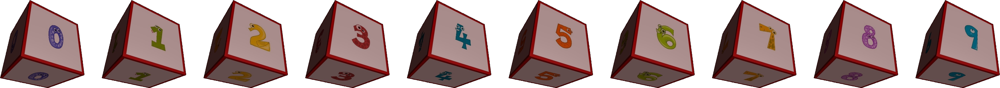
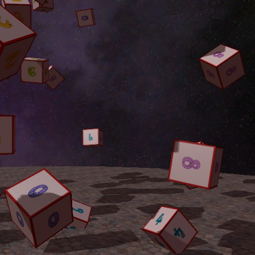
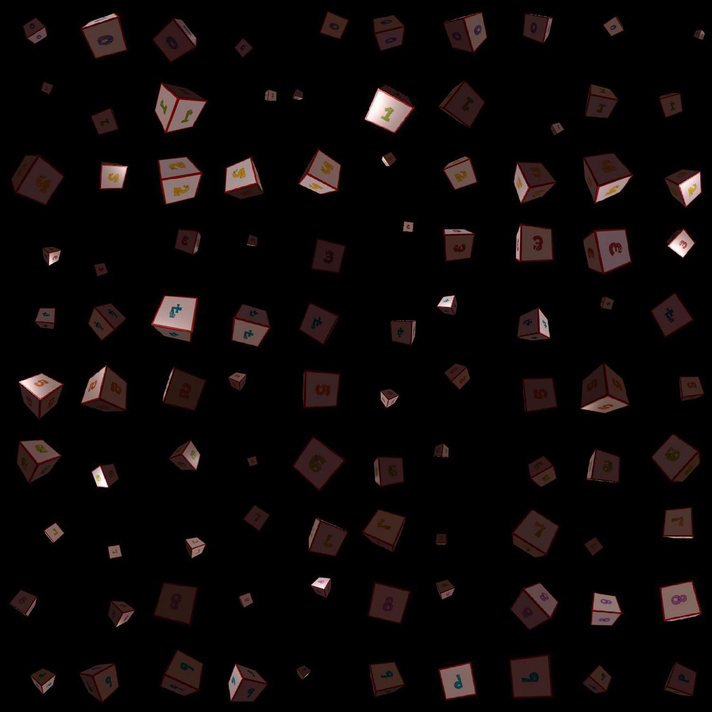
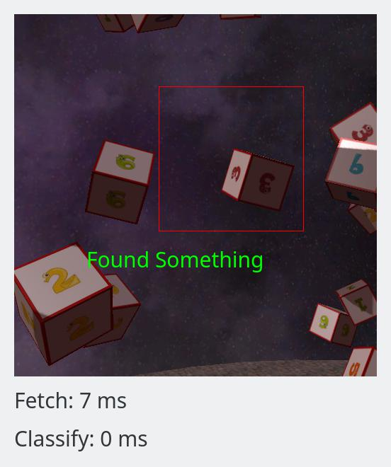
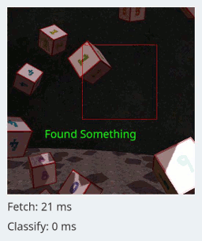

# DS2Server

A simple Space Sim inspired sandbox to experiment with machine learning.

*DS2Server* flies through a (pre-rendered) space simulation. The space itself
is occupied with many objects, most notably of cubes with a number on it.



You may think of it as a 3D version of
the [MNIST](http://yann.lecun.com/exdb/mnist/) data set.

Your job is to build the machine learning model that can spot and identify
those cubes in the scene, like this one.



Once you have your model you can plug it into the Viewer application (see
[View The Space Simulation](#View-The-Space-Simulation) section for details),
you can find out how well (and quickly) it identifies the objects while flying
through the scene. 


## Installation
I have only tested in Ubuntu 16.04, but since it has only Python based
dependencies, it should work on other platforms as well (please let you me know
if this is true) .

```bash
pip install ds2server
```

## Generate Training Data
*DS2Server* ships with 100 training images for each of the ten cubes. Each
one was rendered from a random angle.

```bash
ds2generate
```
This will create a new folder `./dataset` with JPG images.
The source images (100 rendered images for each cube) are in `./dataset/plain`,
whereas `./dataset/aligned` will contain images like this.



This image consists of 10x10 tiles. The cubes in each row all have the same
number on them, but are oriented, placed, and scaled arbitrarily inside their
respective tile. This layout is (hopefully) useful to build and test a spacial
"cube" detector.


## Data Augmentation

One problem with that data set is how clean it is. For instance, they all have
a perfectly black background, each image contains exactly one cube, which is
always in the centre, and always the same distance away from the camera...

As a quick fix, the `ds2generate` script will also have created a
`./dataset/augmented` folder. As the name suggests, it contains a set of
augmented images, and was created with the
excellent [Augmentor](https://github.com/mdbloice/Augmentor) library. However,
the augmentation pipeline is still very much work in progress, and your mileage
with the augmented images may vary.


## View the Space Simulation
This consists of two parts: a web server to server the scene images, and a Qt
application to display them.

First, start the server with:
```bash
ds2server
```

Then put the following code into a file and run it. Note that almost the entire
file is boilerplate for Qt.
```python
import sys
import ds2server.viewer
import numpy as np

import PyQt5.QtGui as QtGui
import PyQt5.QtCore as QtCore
import PyQt5.QtWidgets as QtWidgets


# Ignore for now.
class MyViewer(ds2server.viewer.ViewerWidget):
    def classifyImage(self, img):
        pass


# Define a camera name and assign our custom widget to manage it.
cameras = {'Cam1': MyViewer}

# Qt boilerplate to start the application.
app = QtWidgets.QApplication(sys.argv)
widget = ds2server.viewer.MainWindow(cameras, host='127.0.0.1', port=9095)
widget.show()
app.exec_()
```

This should produce a Qt application that "flies" you through a pre-rendered
scene.

The only lines that are not boilerplate are the `MyViewer` widget (which does
nothing right now), and the definition of a `camera` dictionary. That dictionary
specifies which camera will be controlled by which widget. In this particular
example, we just create a simple camera and use the default widget, which will
merely display the scene.


## Plug Your ML Model Into The Simulation
The real fun is, of course, to use ML to find and identify all the cubes. To do
so, overload the `classifyImage` method in the previous demo like so:

```python
# For convenience.
QPen, QColor, QRectF = QtGui.QPen, QtGui.QColor, QtCore.QRectF
DS2Text = ds2server.viewer.DS2Text

class MyViewer(ds2server.viewer.ViewerWidget):
    def classifyImage(self, img):
        # `img` is always a <height, width, 3> NumPy image.
        assert img.dtype == np.uint8

        # Pass the image to your ML model.
        # myAwesomeClassifier(img)

        # Define a red bounding box.
        x, y, width, height = 0.4, 0.2, 0.4, 0.4
        bbox = [QPen(QColor(255, 0, 0)), QRectF(x, y, width, height)]

        # Define a green text label.
        x, y = 0.2, 0.7
        text = [QPen(QColor(0, 255, 0)), DS2Text(x, y, 'Found Something')]

        # Install the overlays.
        self.setMLOverlays([bbox, text])
```

The `classifyImage` method will be called for each frame, and always receives
one RGB image as a NumPy array with type Uint8. Pass that image to your
classifier any way you like.

Then, when you have found out what is where in the scene, you can add overlays
via the `setMLOverlays` method to highlight it. The arguments to that method is
a list of 2-tuples. The first element in each tuple must be a `QPen` instance,
and it defines the colour and transparency. The second argument specifies what
to draw. Currently, only `QRect` and `DS2Textures` elements are supported.

When you start the application again, you should see an output like this.

Single Frame | Spaceflight
:-------------------------:|:-------------------------:
|


# What Next

## Build and Train ML Models
... obviously, since this is the whole point of this project. If you want to
share your designs and ideas, please let me know.


## Better Data Augmentation
The current training data is very forgiving since each number has a distinct
colour. Early experiments suggest that the models learn the colours, rather
than the digits, since the performance drops sharply when I convert the images
to black/white first.

## Live Rendering
All the images were created by
the [PyHorde](https://github.com/olitheolix/pyhorde) sister project. It wraps
the [Horde3D](http://www.horde3d.org/) engine and uses offline rendering to
produce the images. Eventually I would like to use it as an optional backend
for live rendering. In other words, instead of following a pre-rendered flight
path, *you* control where to fly.

This will also provide a REST API to add and manipulate objects from the
client.


# Feeback
I would be happy to hear from anyone who uses it. Does it work for you? Is
something missing? Which ML models have you built for it, and how well did they
do?
